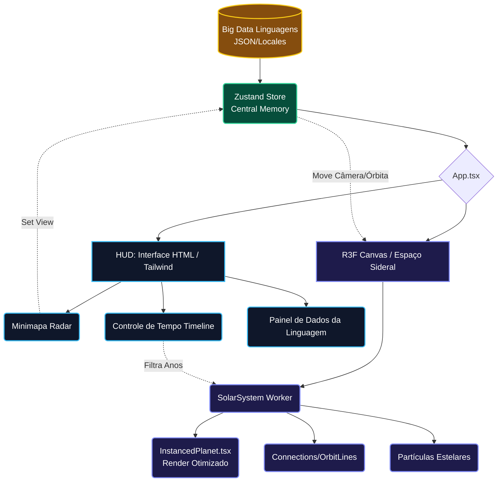

<div align="center">
  

  <h3> Explore a Evolução do Software Através do Cosmos </h3>

  <p>
    <b>Um mapa estelar interativo 3D documentando milhares de linguagens de programação, suas origens, histórias e classificações.</b>
  </p>

  <p>
    
    
    
    
    
  </p>
</div>

---

## 🌌 O que é o CodeOrigins?

Imagine se **cada linguagem de programação fosse um planeta**, um satélite ou uma estrela cintilante em um vasto universo gravitacional. **CodeOrigins** dá vida a essa visão. 

Ele é uma experiência 3D renderizada em tempo real onde você pode navegar pela **história de milhares de linguagens de programação** — descobrindo de onde vieram (suas "órbitas de influência"), quem ou o que as criaram, o paradigma a que pertencem e como "grafitam" ao redor dos grandes "sóis" (como Assembly, C, Lisp, Smalltalk) que ditaram o desenvolvimento do software que usamos hoje.

---

## ✨ Super-Funcionalidades Estelares

- 🪐 **Universo 3D de Código**: Milhares de linguagens renderizadas como corpos celestes com escalas de massa e shaders via `Three.js` e `@react-three/fiber`. O zoom possibilita ir do *Macrouniverso* às minuciosas influências.
- 🧬 **Genealogia e "Gravidade" Histórica**: Ferramentas de conexão mostram a "árvore genealógica" do código. Se Python foi influenciado por C e ABC, elas orbitam nas mesmas faixas gravitacionais.
- ⏱️ **Viagem no Tempo ("Timeline")**: Viaje desde a década de 50 (Fortran) até a atualidade com um controlador temporal, assistindo ao "*Big Bang*" das linguagens em suas ordens de aparição cronológica.
- 🔍 **Filtros por Paradigmas Celestes**: Esconda ou evidencie setores inteiros do universo: isole rapidamente linguagens Funcionais, Orientadas a Objetos, Procedurais, Concorrentes ou de Consulta.
- 🗺️ **Minimapa "Top-Down" e HUD Hi-Tech**: Um minimapa posicionado no console da UI age como um Radar Naval interativo – ative, desative órbitas, e localize satélites a "anos-luz" de distância da sua visualização atual.
- 🌐 **Internacionalização (i18n) Nativas**: Exploradores do mundo todo são bem-vindos! Um sistema de dicionários dinâmico injeta assincronamente descrições técnicas na linguagem local.

---

## 🏗️ Engenharia do Espaço-Tempo (Arquitetura)

Manter milhares de objetos em órbita exige um rigor de engenharia severo. Para garantir os sagrados **60 FPS** ao navegar pelo espaço, nós desacoplamos a reatividade visual (UI HTML) da atualização crítica de câmera e renderização `WebGL`.



> **Curiosidade Técnica**: Em vez de renderizar milhares de `Mesh` React individuais e estrangular a Thread, a renderização de planetas secundários tira proveito pesado de `InstancedMesh` e do hook `useFrame` fora da árvore de reatividade comum. O `Zustand` serve como um buraco de minhoca comunicando dados velozmente entre a Camada React UI (DOM) e o ecossistema R3F/Threejs sem forçar re-renders.

---

## 🛠 Tecnologia Sob o Capô (Tech Stack)

A fusão nuclear que potencializa a aplicação se dá pelas seguintes maravilhas:

| Tecnologia | Função na Engenharia Estelar |
|:---:|:---|
|  | **React 19**: O esqueleto da interface gráfica utilitária. |
|  | **Three.js + R3F**: A "Fórmula da Gravidade". Controle total de posições de vértices, matemática vetorial e materiais para os planetas. |
|  | **Tailwind CSS v4**: Constelações de tipografia, botões neon e designs vitrificados desenhados em milissegundos. |
|  | **TypeScript**: A rede de segurança fundamental para garantir que uma estrela não sofra de `undefined is not a function`. |
|  | **Framer Motion**: As animações fluidas, os aparecimentos holográficos da linguagem clicada e telas de Loading. |

---

## 🚀 Como Lançar E Iniciar na Sua Máquina

Construído com extrema eficiência utilizando Vite.

### Pré-requisitos
- **Node.js**: `v18+` (Se possível `v20`)
- Um terminal e vontade de explorar.

### Protocolo de Ignição

```bash
# 1. Clone os projetos holográficos (Clone Repository)
git clone https://github.com/seu-perfil/CodeOrigins.git

# 2. Caminhe para a Câmara de Propulsão
cd CodeOrigins

# 3. Abasteça a nave (Install Dependencies)
npm install

# 4. Decolagem (Run dev Server)
npm run dev
```

Abra em suas miras infravermelhas o link (normalmente `http://localhost:3000`) ou o que for gerado, e aproveite a viagem!

---

## 📂 Dissecando a Sonda (Estrutura de Arquivos)

Aqui está um mapa estelar do próprio código fonte de onde geramos nossas galáxias:

```js
📦 CodeOrigins
 ┣ 📂 src
 ┃ ┣ 📂 components        // Painéis do Hardware Espacial:
 ┃ ┃ ┣ 📜 SolarSystem.tsx // Hub central WebGL agrupando Lógica ThreeJS
 ┃ ┃ ┣ 📜 Planet.tsx      // A física visual (malha/cor) individual da Linguagem
 ┃ ┃ ┣ 📜 Minimap.tsx     // HUD visual Top-Down do controle de mapas
 ┃ ┃ ┣ 📜 Timeline.tsx    // Sliders de Séculos e Anos de evolução
 ┃ ┃ ┗ ...
 ┃ ┣ 📂 data             // O banco de dados do núcleo (categorizações, i18n dos idiomas)
 ┃ ┣ 📂 services         // Motores FTL: serviços de carregamento localeLoader.ts
 ┃ ┣ 📜 App.tsx          // Ponto Singular: Conexão Câmera UI <-> Motor 3D
 ┃ ┣ 📜 store.ts         // A "Matéria Escura": Estado Global via Zustand
 ┃ ┗ 📜 index.css        // A Escuridão do Layout Global em Tailwind
 ┣ 📜 package.json       // Inventário da Tripulação (Módulos NPM)
 ┗ 📜 vite.config.ts     // Controle Mestre de Montagem
```

---

## 🌟 Expanda este Universo (Como Contribuir)

Descobriu uma linguagem obscura oriunda dos anos 80 em um Mainframe esquecido? Quer adicionar um novo cinturão de asteróides ou mapear constelações de bibliotecas Javascript? Nossas órbitas recebem todos os exploradores!

1. Conecte-se e faça o **fork** da repositório.
2. Crie uma rota interestelar: `git checkout -b feature/sua-sonda-espacial`
3. Trabalhe no laboratório e documente: `git commit -m 'feat: adicionar telemetria para a linguagem Go'`
4. Faça o upload das coordenadas: `git push origin feature/sua-sonda-espacial`
5. Pressione a ignição via **Pull Request (PR)**.

### Licença e Distribuição 📝
Sob as sagradas leis do mundo Open Source. Este universo respira código aberto através da Licença [Apache 2.0](LICENSE). Divirta-se criando sistemas estelares baseados nele.

---

<br/>

<div align="center">
  <p><b>✨ Construído com poeira estelar por desenvolvedores apaixonados por história da computação.</b></p>
  
  
</div>
