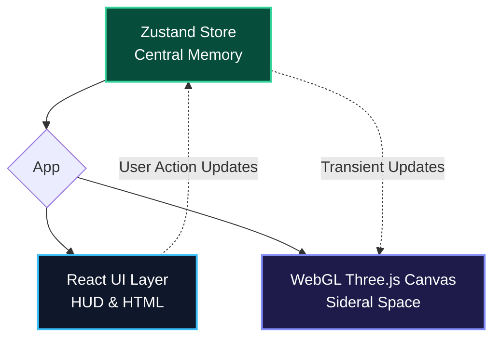

# Engineering and Outer Space Architecture

Building CodeOrigins requires maintaining thousands of objects processed in the 3D canvas and, simultaneously, allowing complex HTML HUDs and tools to respond instantly. The main architecture focuses on a **severe decoupling of the UI and the WebGL engine**.

## System Overview

CodeOrigins is a Single Page Application developed in **React** and **Vite**, operating in two fundamental layers that must never interrupt each other's thread:

1. **Atmospheric Layer (UI / DOM):** Contains the Tailwind panels, buttons, temporal sliders, and the interactive Minimap.
2. **Sidereal Layer (WebGL/Canvas):** The pure simulation via `Three.js` + `@react-three/fiber` managing all the dense rendering of 3D meshes and vertices.



## The Einstein-Rosen Bridge (Zustand)

React suffers from rendering cascades when props change at the top of the tree. If an HTML slider updated the central React state encapsulating the 3D engine, extreme stuttering and sudden FPS drops would occur every time you moved the mouse.

**To combat this, we use `Zustand`.**
It acts as our central store and, most importantly, in a non-reactive way right in the main hierarchy:
- **UI Panels** read (via Zustand hooks) and write actions to the Store.
- The **3D Engine**, mainly through asynchronous `useFrame()` hooks, spies on the Store from outside the React lifecycle (*transient updates*).

This way, navigation flows without expensive DOM repainters. The Canvas orbits at a wonderful continuous 60FPS to 144FPS.

## The 3D Performance Challenge (InstancedMesh)

The biggest potential bottleneck of our probe would be rendering ~3,000 instances of a React `<Planet />` component using elementary `<mesh />` nodes in the pipeline. For the browser, this would cause fatal *drawcalls* for the CPU.

The architectural solution is **Instanced Rendering**.
Instead of processing Planet 'Ruby' and Planet 'PHP' separately from scratch, we invoke *Instanced* meshes (multiple copies of the same base geometry orbiting dystopian spatial coordinates) in massive batches (`<instancedMesh>`). 

This groups thousands of bodies into a singular subset sent to the video card (GPU) buffer *all at once*! 

## Visual State Flow:
```
[Minimap UI Interaction (HTML Click)] 
  👉 [Action Executed in Zustand Store] 
    👉 [Zustand triggers atomic notification] 
      👉 [WebGL SolarSystem Component patches variable with let/ref] 
        👉 [Threejs Hook uses mathematical easing and flies 3D Camera to Target]
```

## Router (Single Page Navigation)
Currently, navigation between HUDs in the UI is entirely anchored by a state panel (e.g., "showDocs", "selectedPlanetId", "hudMode"). Thus, the 3D scene in the background remains constant, while the "screens" are opened overlaid by the interface's React engine.
